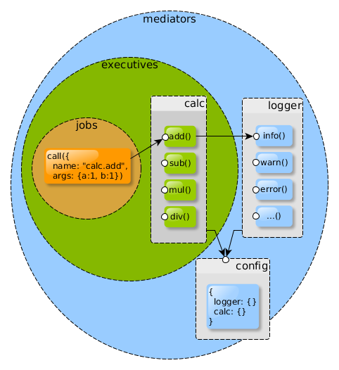
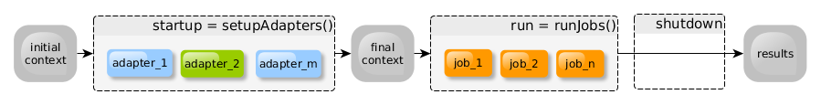
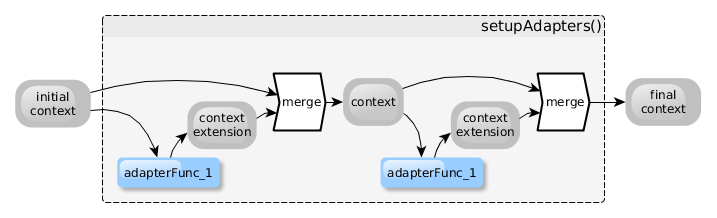
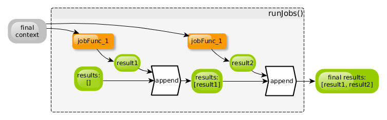

`npac` Documentation
====================

## Goals and Principles

The goals of writing `npac` are to:

- minimize the boilerplate code required by an application,
- makes possible each parts of a system easily unit-testable, even the whole application as a unit too,
- provide reusable architecture templates for typical applications that conforms to the [12 factors](https://12factor.net) directives,
- make high level system components easily composable.

With `npac` you can build systems out of loosely coupled, high cohesion components by composition.

You can leverage the advantages of the the separation of concerns principle.
In this context, separation of concerns primarily means to separate infrastructure related code
from business-logic related code.

Business logic implementation and configuration info are the parts of an application that makes it unique,
and these components of a system that are the subject of frequent change.

Infrastructure related modules are typically reusable libraries of frameworks, that change incrementally,
and less frequently, and mostly should not be unique per application.

The application should be built upon reusable infrastructure modules, clean business logic code,
and configuration info.
In most of the cases only config and business code are the things that worth to invest efforts into
their implementation.

## What `npac` is

`npac` is made of the following parts:

- A `start()` function, that creates a runtime context (a lightweight container) for your application to run.
- Some adapters, which required for a typical application, such as configuration management, logging and lifecycle management.
- Some wrapper functions that makes simple to create and run an `npac` based application.

## What `npac` is not

It is not an implementation of the classic hexagonal architecture pattern.

It does not necessarily follow the MVC pattern, dependency layering, or other strict regulation of 
classic PoA or onion  architectures.

`npac` is not about abstraction layering, but it is about the independence of connected modules 
that an application is made of and built upon by composition.

Obviously it is worth to keep the one-directional dependency structure,
and data isolation rules in case of the design and implementation of individual modules built into the application,
but an `npac` application itself is focusing on to easily integrate very high-level system components
on a flexible way.

`npac` applies some elements of the PoA philosophy, but it is very much an unopinionated solution,
that you can use many ways.

## Overview of a generic architecture

The control code of an application and the business logic should be separated from each other.
So that the business logic part should be possible to run independently from the modules that controls its working.
Keep the logic in a headless module which provides a universal interface, 
and make this working from several places, such as test code, UI, CLI, other parts of the system 
via mediator modules (that may use messaging, etc.).

Practically every application is made of the following parts:

- An interface, through which its execution is controlled (parameterized, started and stopped).

- [Configuration](https://12factor.net/config) info, coming from:
   - built-in defaults,
   - environment,
   - config file,
   - CLI or GUI parameters.

- Business-logic modules.

  They hold the business logic functions, and use infrastructural modules, such as repositories, 
  communication, logging, monitoring, etc.

- Infrastructure modules.
   - These modules are responsible to mediate between the business logic,
     and [the backing services](https://12factor.net/backing-services).
   - They provide an internal API, that acts as a facade towards the business calls.
   - These modules can be classified by the API they provide.
     For example: there can be a generic API defined for communication among micro services,
     using content pattern matching, or another API for repositories.
     These repository APIs may vary on the given class of stores it mediates for,
     such as an API optimal for relational repositories, another for blob stores, or graph stores, etc.
   - The specific backing services, as resources are hidden from the business logic,
     and the module must not contain business related code, only generic type of code.
     The configuration of resources provide the backing services are delivered through
     the central configuration module of the architecture.
   - A typical, frequently used infrastructural module is added for [logging](https://12factor.net/logs),
     which is typically forwards the logs toward backing-services, based on the configuration,
     and provides a generic API for the other modules,
     independent of the logger module it uses for implementatiton.

- Job(s), or main process(es)
   - The app is executed in the execution environment as [one or more processes](https://12factor.net/processes).
   - These processes may need some parameter to run, and also they need to access to the modules of 
     business logic, and to the infrastructure modules (directly, or indirectly through 
     the business logic type of modules).
   - There can be more than one, similar processes implemented and maintained in parallel wit each other.
     Beside the main application process, [one-off admin processes](https://12factor.net/admin-processes),
     may also used, and these should use the same codebase, and configuration without duplicating the code.

- Life-cycle manager functions
   - Application processes are that [disposable](https://12factor.net/disposability).
     They should minimize their startup time, and could be gracefully shut down
     when they receive a SIGTERM signal from the process manager.
   - There must be functions that are responsible for the controlled, and standard way of startup
     and shutdown processes.

## The components of an `npac` architecture

An application, that is built upon `npac`, is made of the following components:

- __Container__, or __context__:
  This is an object, which holds the adapters, and makes their APIs available for the other adapters,
  and for the jobs.

- __Adapters__:
  These are modules, that implement the functionalities of the application.

  They can be categorized into two groups:
    - __Mediators__:
      These modules hold no business logic, but may communicate with external services.

      For example:
        - central configuration module,
        - data stores,
        - dispatcher ([patrun](https://www.npmjs.com/package/patrun)),
        - http(s) server,
        - microservice container.
        
      They do not call business logic directly through the API reacheable via the context,
      but may communicate with business modules, if they were registered to them.
      For example a microservice framework plays a communication channel among internal and/or 
      external micro service implementation modules, that hold the business logic, 
      and were registered to cooperate with the framework.

      There is a special modiator type module, which is called __config__.
      It always exists, and may uses external resources to gain config info.
      Its responsibility to provide configuration info to all of the modules exist in the container.
      
    - __Executives__:
      These modules may use other business logic modules and/or infrastructure modules through 
      their APIs provided via the context.

      For example:
        - micro service implementations,
        - functions, operators.

  Every adapter has access to the whole context.

- __Jobs__:
  These are simple functions that represent the main process of the application.

  They call executives and in some cases may also call mediators as well, such as config and logging, etc.

  Every job has access to the whole context.

## The lifecycle of an npac application

1. __startup__

   Sets up the context, using the adapters.
   The purpose of the setup process is to create the context for the jobs that will be executed 
   during the run phase.

2. __run__

   Executes the jobs.

3. __shutdown__

   Gracefully shuts-down the jobs and adapters, then exit.

